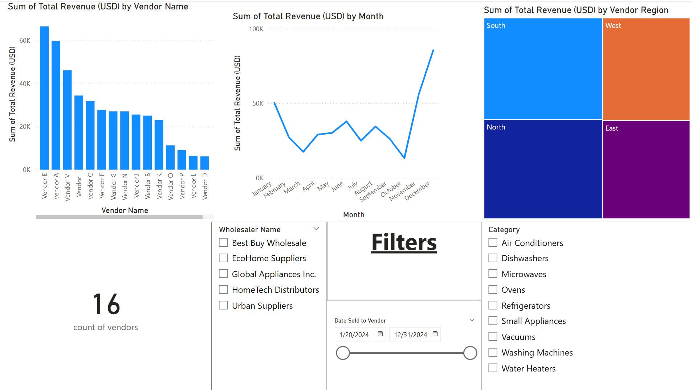
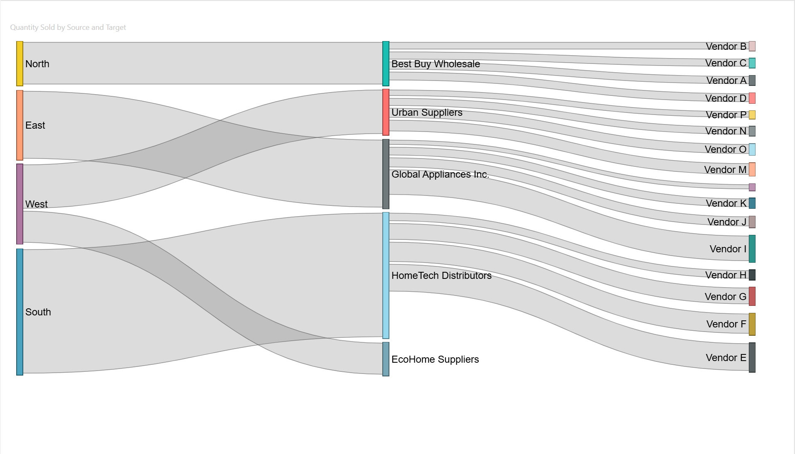

# 🏠 Household Appliances - Sales & Vendor Flow Dashboard (Power BI)

This Power BI project visualizes sales performance and supply chain flows for a household appliances company that sells products to various wholesalers and receives inventory from multiple vendors.

---

## 📁 Datasets Used

### 1. `sales_data.csv`
Contains transactional sales data from the company to wholesalers.

**Key Fields:**
- `Date`
- `Product_Name`
- `Wholesaler_Name`
- `Units_Sold`
- `Sales_Amount`
- `Region`

### 2. `vendor_movements.csv`
Tracks product movements from vendors to the company warehouse.

**Key Fields:**
- `Date`
- `Product_Name`
- `Vendor_Name`
- `Quantity_Received`
- `Warehouse_Location`

---

## 📊 Dashboards Overview

### 1. **Wholesaler Sales Dashboard**
Visualizes sales volume and revenue across products, regions, and time.

**Visuals:**
- Bar chart: Sales by wholesaler
- Line chart: Monthly sales trends
- Matrix: Product performance
- KPI Cards: Total Sales, Units Sold
- Filters: Product, Wholesaler, Region, Date

---

### 2. **Vendor Movements Dashboard**
Displays product inflow from vendors, highlighting key suppliers and stock levels.

**Visuals:**
- Bar chart: Quantity received by vendor
- Table: Vendor-to-product movement
- Time series: Inventory receipt trends
- Filters: Vendor, Product, Date

---

### 3. **Sankey Diagram – Vendor to Wholesaler Flow**
An interactive Sankey diagram showing the flow of goods through the supply chain.

**Flow:**
`Vendor_Name` → `Product_Name` → `Wholesaler_Name`

**Value Metric:**
- `Units` or `Quantity_Moved`

---

## 🛠️ Tools & Visuals

- **Power BI Desktop**
- **Custom Visuals Used:**
  - Sankey Chart (from AppSource or Deneb/Vega-Lite if customized)
- **DAX Measures:**
  - `Total Sales = SUM(Sales_Amount)`
  - `Total Units = SUM(Units_Sold)`
  - `Quantity Received = SUM(Quantity_Received)`

---

## 📦 How to Use

1. Open the `.pbix` file in Power BI Desktop.
2. Load or refresh data sources (`sales_data.csv`, `vendor_movements.csv`).
3. Navigate across tabs: `Sales Dashboard`, `Vendor Dashboard`, `Sankey Flow`.
4. Use slicers to explore relationships by product, date, region, and entity.

---

## 📈 Business Value

This dashboard enables the company to:
- Monitor sales performance by wholesaler
- Optimize vendor relationships and supply planning
- Visualize end-to-end flow from suppliers to clients
- Make informed decisions based on time-based trends

---

## 🧩 Future Enhancements

- Integrate real-time data using APIs or SQL sources
- Add stock levels and reorder point analysis
- Enable predictive sales modeling

---

## 🖼️ Dashboard Screenshots

| Wholesaler Sales Overview | Vendor Movement Overview |
|---------------------------|---------------------------|
|  |  |

### 🔁 Sankey Diagram – Vendor to Wholesaler Flow

---

## 👤 Author

**Mohamed Benrabah**  

